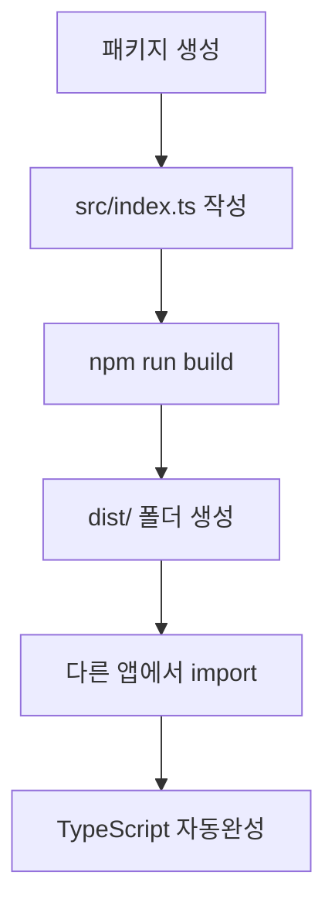

# 📦 모노레포 패키지 시스템 - 빠른 시작 & 상세 가이드

## 🏃‍♂️ 빠른 시작

### 1. 새 패키지 만들기

```bash
mkdir packages/my-package
cd packages/my-package
npm init -y
```

### 2. 패키지를 앱에서 사용하기

```json
// apps/feta/package.json
{
  "dependencies": {
    "@repo/my-package": "workspace:*"
  }
}
```

```typescript
import { MyComponent } from '@repo/my-package';
```

### 3. 주요 명령어

```bash
npm run build                  # 전체 빌드
npm run build --filter=@repo/shared-ui    # 특정 패키지만 빌드
npm run dev --filter=feta      # 앱 개발 서버 실행
npm install                    # 새 의존성 설치
```

### 4. 개발 팁

- 패키지 수정 후 `npm run build --filter=@repo/패키지명`
- 타입 에러: 타입 추가/빌드/경로 확인

### 5. 사용 예시

```typescript
import { Icon, IconName } from '@repo/shared-ui';
<Icon name="home" size={24} color="blue" />
```

---

## 🏗️ 모노레포 구조 개념

### 기본 개념

```
monorepo/
├── apps/           # 실제 애플리케이션들
│   └── feta/       # FETA PWA 앱
│
└── packages/       # 공통 패키지들
    ├── shared-config/  # 설정 패키지
    ├── shared-ui/      # UI 컴포넌트 패키지
    └── shared-utils/   # 유틸리티 패키지 (예정)
```

## 🔧 패키지 생성과 동작 원리

### 1. 패키지는 어떻게 생성되나요?

#### Step 1: 폴더 구조 생성

```bash
packages/shared-ui/
├── package.json     # 패키지 정보 & 의존성
├── tsconfig.json    # TypeScript 설정
└── src/
    ├── index.ts     # 메인 진입점 (export 담당)
    ├── Icons.tsx    # 실제 컴포넌트
    └── utils.ts     # 유틸리티 함수
```

#### Step 2: package.json 설정

```json
{
  "name": "@repo/shared-ui", // ← 패키지 이름
  "version": "0.1.0",
  "private": true, // ← npm에 배포하지 않음
  "exports": {
    // ← 다른 앱에서 import할 때 사용
    ".": {
      "import": "./dist/index.mjs", // ← ESM 방식
      "require": "./dist/index.js", // ← CommonJS 방식
      "types": "./dist/index.d.ts" // ← TypeScript 타입
    }
  },
  "scripts": {
    "build": "tsup src/index.ts --format cjs,esm --dts" // ← 빌드 명령
  }
}
```

#### Step 3: src/index.ts (진입점)

```typescript
// 🎯 이 파일이 다른 앱에서 import할 때 실행되는 파일
export { default as Icon } from './Icons'; // Icons.tsx에서 Icon 컴포넌트 내보내기
export type { IconName } from './Icons'; // TypeScript 타입 내보내기
export { cn } from './utils'; // 유틸리티 함수 내보내기
```

### 2. 패키지 빌드 과정

#### 빌드 명령

```bash
npm run build  # 또는 npx turbo build --filter=@repo/shared-ui
```

#### 빌드 결과물

```
packages/shared-ui/dist/
├── index.js      # CommonJS 버전
├── index.mjs     # ES Module 버전
├── index.d.ts    # TypeScript 타입 정의
└── index.d.mts   # TypeScript ES Module 타입
```

### 3. 다른 앱에서 어떻게 사용하나요?

#### Step 1: 의존성 설정 (package.json)

```json
// apps/feta/package.json
{
  "dependencies": {
    "@repo/shared-ui": "*" // ← npm workspace에서 가져오기
  }
}
```

#### Step 2: 코드에서 사용

```typescript
// apps/feta/src/components/MyComponent.tsx
import { Icon, IconName } from '@repo/shared-ui';  // ← 패키지에서 import

function MyComponent() {
  return (
    <div>
      <Icon name="home" size={24} color="blue" />  {/* ← 사용 */}
    </div>
  );
}
```

## 🔄 패키지 시스템 동작 흐름

### 전체 과정



## 🛠️ tsup: TypeScript 패키지 빌드 도구

### tsup이란?

**tsup**은 TypeScript 프로젝트를 위한 **초간단 번들러**입니다! 복잡한 webpack 설정 없이도 TypeScript
패키지를 쉽게 빌드할 수 있어요.

### 🎯 tsup의 역할

```typescript
// src/index.ts (입력)
export const formatDate = (date: Date): string => {
  return date.toLocaleDateString("ko-KR");
};

// ↓ tsup이 자동 변환 ↓

// dist/index.js (CommonJS - Node.js용)
exports.formatDate = (date) => {
  return date.toLocaleDateString("ko-KR");
};

// dist/index.mjs (ES Module - 브라우저용)
export const formatDate = (date) => {
  return date.toLocaleDateString("ko-KR");
};

// dist/index.d.ts (TypeScript 타입)
export declare const formatDate: (date: Date) => string;
```

### 📦 tsup vs 다른 도구들

| 도구    | 설정 복잡도  | 빌드 속도 | TypeScript 지원   |
| ------- | ------------ | --------- | ----------------- |
| Webpack | 😵 매우 복잡 | 🐌 느림   | 🔧 추가 설정 필요 |
| Rollup  | 😐 보통      | 🚀 빠름   | 🔧 플러그인 필요  |
| tsup    | 😍 매우 간단 | 🚀 빠름   | ✅ 완벽 지원      |

### ⚙️ tsup.config.ts 설정

```typescript
import { defineConfig } from 'tsup';

export default defineConfig({
  entry: ['src/index.ts'], // 진입점
  format: ['cjs', 'esm'], // CommonJS + ES Module 동시 생성
  dts: true, // .d.ts 타입 파일 생성
  sourcemap: true, // 디버깅용 소스맵
  clean: true, // 빌드 전 dist/ 폴더 정리
  splitting: false, // 코드 분할 비활성화
  treeshake: true, // 사용하지 않는 코드 제거
});
```

### 🏗️ 빌드 결과물

```bash
# npm run build 실행 후
packages/shared-utils/dist/
├── index.js      # Node.js용 (CommonJS)
├── index.mjs     # 브라우저용 (ES Module)
├── index.d.ts    # TypeScript 타입 정의
├── index.js.map  # 소스맵 (디버깅용)
└── index.mjs.map # 소스맵 (디버깅용)
```

### 실제 예시: Icon 컴포넌트

```typescript
// 1. packages/shared-ui/src/Icons.tsx
const Icon = ({ name, size = 24 }) => {
  /* 구현 */
};
export default Icon;

// 2. packages/shared-ui/src/index.ts
export { default as Icon } from "./Icons";

// 3. 빌드 후 apps/feta에서 사용
import { Icon } from "@repo/shared-ui";
```

## 🎯 워크스페이스 (Workspace) 시스템

### package.json (루트)

```json
{
  "workspaces": [
    "apps/*", // apps 폴더의 모든 하위 폴더
    "packages/*" // packages 폴더의 모든 하위 폴더
  ]
}
```

### npm workspaces 장점

- **의존성 호이스팅**: 같은 패키지는 루트에 한 번만 설치
- **내부 패키지 연결**: `@repo/shared-ui`를 실제 파일로 연결
- **빠른 설치**: 중복 설치 없이 심볼릭 링크 사용

## 📦 패키지별 도구 설치 가이드

### 🤔 매번 각 패키지에 설치해야 하나요?

**답: 아니요! 효율적으로 관리할 수 있습니다.**

### 방법 1: 루트에서 공통 devDependencies 관리

```json
// 루트 package.json
{
  "devDependencies": {
    "tsup": "^8.3.5", // ← 모든 패키지에서 사용
    "typescript": "^5.7.2", // ← 모든 패키지에서 사용
    "prettier": "^3.6.2" // ← 코드 포맷팅
  }
}
```

### 방법 2: 각 패키지별 개별 설치

```bash
# shared-utils에만 tsup 설치
npm install tsup --save-dev --workspace=@repo/shared-utils

# shared-ui에만 설치
npm install tsup --save-dev --workspace=@repo/shared-ui
```

### 방법 3: 하이브리드 방식 (권장!)

```json
// 루트 package.json (공통 도구들)
{
  "devDependencies": {
    "typescript": "^5.7.2",  // 모든 곳에서 사용
    "prettier": "^3.6.2",    // 코드 포맷팅
    "turbo": "^2.5.6"        // 빌드 오케스트레이션
  }
}

// packages/shared-utils/package.json (패키지 전용)
{
  "devDependencies": {
    "tsup": "^8.3.5",        // 번들링 전용
    "@types/crypto-js": "^4.2.2"  // 타입 정의
  }
}
```

### 🎯 권장 전략

| 도구         | 설치 위치    | 이유                          |
| ------------ | ------------ | ----------------------------- |
| `typescript` | 🏠 루트      | 모든 곳에서 사용              |
| `prettier`   | 🏠 루트      | 코드 스타일 통일              |
| `eslint`     | 🏠 루트      | 코드 품질 관리                |
| `tsup`       | 📦 각 패키지 | 번들링 필요한 곳만            |
| `@types/*`   | 📦 각 패키지 | 해당 라이브러리 사용하는 곳만 |
| `react`      | 📱 각 앱     | 앱별로 버전이 다를 수 있음    |

### 💡 실제 설치 명령어

```bash
# 루트에서 공통 도구 설치
npm install typescript prettier eslint --save-dev

# 특정 패키지에만 설치
npm install tsup --save-dev --workspace=@repo/shared-utils
npm install vite --save-dev --workspace=feta
```

## 🚀 Turborepo 역할

### turbo.json

```json
{
  "pipeline": {
    "build": {
      "dependsOn": ["^build"], // ← 의존하는 패키지를 먼저 빌드
      "outputs": ["dist/**"]
    }
  }
}
```

### 의존성 자동 관리

```bash
npx turbo build --filter=feta
# 1. shared-ui 패키지 먼저 빌드
# 2. 그 다음 feta 앱 빌드
```

## 💡 실제 사용 시나리오

### 시나리오 1: 새로운 아이콘 추가

```typescript
// 1. packages/shared-ui/src/Icons.tsx에 아이콘 추가
const iconMapping = {
  // ... 기존 아이콘들
  newIcon: 'tabler:new-icon',  // ← 새 아이콘 추가
};

// 2. 빌드
npm run build

// 3. 모든 앱에서 바로 사용 가능
<Icon name="newIcon" />  // ← 자동완성도 지원!
```

### 시나리오 2: 새로운 앱 추가

```bash
# 1. 새 앱 생성
apps/admin/

# 2. package.json에 의존성 추가
{
  "dependencies": {
    "@repo/shared-ui": "*",
    "@repo/shared-config": "*"
  }
}

# 3. 바로 사용 가능
import { Icon } from '@repo/shared-ui';
```

## 🔍 디버깅과 개발

### 개발 시 주의사항

```bash
# 패키지를 수정했다면 다시 빌드 필요
npm run build --filter=@repo/shared-ui

# 또는 watch 모드로 자동 빌드
npm run dev --filter=@repo/shared-ui
```

### 타입 에러 해결

```typescript
// ❌ 타입 에러 발생
<Icon name="unknown-icon" />

// ✅ 패키지에 아이콘 추가 후 사용
const iconMapping = {
  'unknown-icon': 'tabler:question'
};
```

## 🎁 패키지 시스템의 장점

### 1. 코드 재사용

- 한 번 작성하면 모든 앱에서 사용
- 중복 코드 제거

### 2. 일관성

- 같은 Icon 컴포넌트를 모든 앱에서 사용
- 디자인 시스템 통일

### 3. 유지보수

- 버그 수정이나 기능 추가를 한 곳에서만
- 타입 안전성으로 에러 방지

### 4. 성능

- Tree shaking으로 사용하는 부분만 번들에 포함
- 공통 의존성 중복 제거
